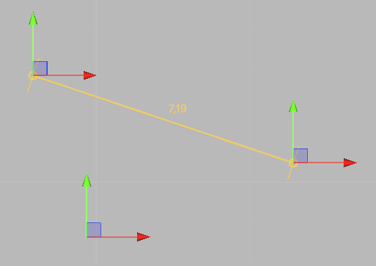
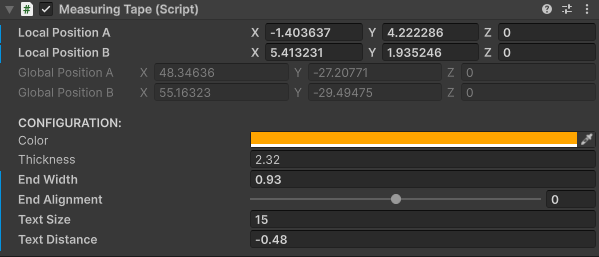
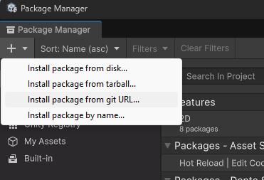

# Unity measuring tape

A Unity tool to measure distances in level scenes.

  

By default, Unity editor lacks a built-in tool to measure distances. There are 
plenty of options at the Unity Assets Store, but they are paid ones. With this
tool I want to offer a free and open-source alternative. 

## Usage

The most straightforward way to use the tool is clicking "Tools->Add measure tape" 
at the main menu bar. A measuring tape GameObject will be added to scene hierarchy.
Then, you can move the entire tape dragging its transform, or you can drag 
either of its ends. A line will be drawn between those ends, displaying the 
measured distance near its center.

Provided prefab is only an empty transform with this tool script attached. You
can use the tool script as a component of your own prefabs. Just be aware that 
the tool is set up to be drawn always, even when the tool object is not selected. 
To hide the measuring tape, you must disable its GameObject or the tool script 
itself in the inspector.

When you move the measuring tape ends, their relative positions are displayed at 
the inspector, where they can be edited too. If you edit them at the inspector, 
the tape ends will be updated accordingly. Remember that you are editing 
positions relative to measuring tape root transform.

  

As a convenience, the tool inspector shows the tape ends global positions as 
read-only fields under those of the relative position fields.

## Configuration

As it was said before, a tool script lets you set the relative positions of
tape ends. Apart from that, every other configuration field refers to visual
appearance. Those configuration fields are:

* *Color*: Color for this tool.
* *Thickness*: Line thickness.
* *End Width*: Width for the perpendicular ends of the line.
* *End Alignment*: End bias.
* *Text Size*: Text size for the distance.
* *Text Distance*: Distance between the text and the line.

Most of those fields are self-explanatory. If you don't fully understand what
they do, you can play with them to see how they affect the tool.

*End Width* refers to the crosslines at the ends of the tape. This field defines
its length. 

By default, that crossline at the end is centered with the tape. *End Alignment" is 
a value from -1 to 1 that can be used to displace the crossline to the right or left
of the tape.

You can also bias the distance text position using *Text Distance*. Change it to
place distance text nearer or farther from the tape. Be aware about you can use
negative values to place the text at the other side of the tape.

## Install

The easiest way to install this package is through Unity Package Manager. Open 
it clicking "Window-> Package Management-> Package Manager". Then, click at the 
plus icon at the top left corner of the window and select "Add package from git 
URL...". In the upcoming field, paste the cloning URL of this repository.

  

Wait until installation finishes and you will find the entry, in the "Tools" 
menu, to create a measuring tape.

This installation method has the added advantage of being able to update the 
tool to the latest version. When you know that a new version is available, 
you can click on the "Update" button in the Package Manager window and the tool 
will be updated.

## Feedback

Author: Dante Signal31 

e-mail: dante.signal31@gmail.com

Follow me on X: [@dante_signal31](https://x.com/dante_signal31)
